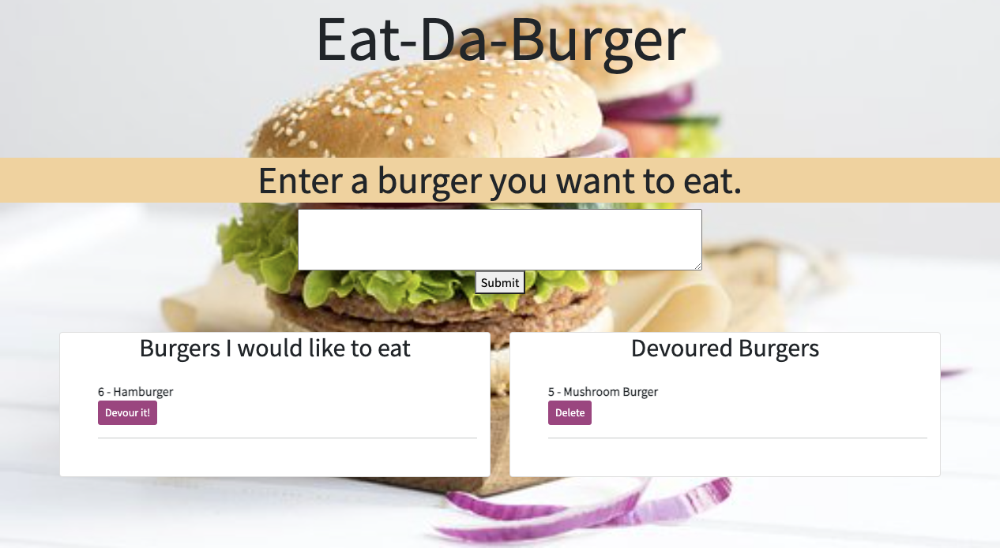

# BURGER-APP
Eat-Da-Burger

  

  - [Description](#Description)
  - [Installation](#Installation)
  - [Usage](#Usage)
  - [License](#License)
  - [Contributing](#Contributing)
  - [Tests](#Tests)
  - [Questions](#Questions)

## Description

Burger App created with MySQL, Node, Express, Handlebars and ORM.

## Table of Contents

## Installation 

MySQL, Exress, Express-handlebars

## Usage

Eat-Da-Burger is a restaurant app that lets users input the names of the burgers they'll like to eat. When the users submits burger's name it will display on the left side of the page with the button under it "Devour". When user clicks the button, the burger will move to the right side of the page and will have a button delete to delete devoured burgers. 

## License 

MIT-License

## Contributing 

Fork the repo and make pull request to contribute.

## Tests

Fork the repo and clone to local machine, after that make local branch for testing.

## Questions

* GitHub username Dilberovicka31
* Feel free to contact me for additional questions dilberovicm36@gmail.com

## Link to deployed application 
https://agile-shore-61720.herokuapp.com/

## Image of the application:

